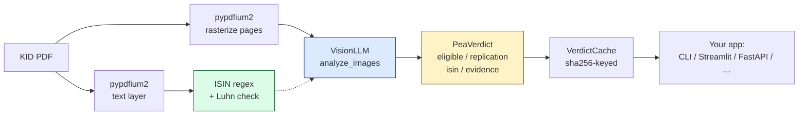

# pea-audit

[](https://pypi.org/project/pea-audit/)
[](https://pypi.org/project/pea-audit/)
[](https://github.com/AndreLiar/pea-audit/actions/workflows/ci.yml)
[](LICENSE)

Audit French **PEA** (Plan d'Épargne en Actions) eligibility of ETFs by reading their **KID** (Key Information Document) with a vision LLM. Tells you whether a fund is actually eligible for a French PEA account — with verbatim citations from the document.

> **What is a PEA?** France's tax-sheltered stock account (€150k cap, gains tax-free after 5 years). It only accepts EU-domiciled equities, or UCITS funds that *synthetically* replicate non-EU indexes (S&P 500, MSCI World, Nasdaq, …) via a swap on an EU-equity basket. Physical-replication funds of non-EU indexes — most iShares Core / Vanguard ETFs — don't qualify. **This library tells you which side of that line your fund is on.**

> **What's in this repo?** Two things: **`pea-audit`** — the library you `pip install` (lives in `pea_audit/`) — and **ETFTracker** — a reference app that consumes it (Streamlit dashboard + CLI + FastAPI at the repo root, plus `etftracker/` helper code). Most of this README is about the library; see [ETFTracker.md](ETFTracker.md) for the app side (French).

**Latest:** [v0.2.0](https://github.com/AndreLiar/pea-audit/releases/tag/v0.2.0) — async API, typed Enums, prompt-version cache key, SSRF guard, 51 unit tests. Full history in [CHANGELOG.md](CHANGELOG.md).

```
$ python audit_cli.py samples/amundi_pea_monde_kid.pdf
📄 Audit de : samples/amundi_pea_monde_kid.pdf

  ✅ ÉLIGIBLE PEA    (confiance : high)

  Émetteur     : Amundi
  ISIN         : FR001400U5Q4
  Indice       : MSCI World Index EUR
  Réplication  : synthetic_swap

  Le fonds est éligible au PEA car il utilise une réplication synthétique
  via swap (IFT) avec un panier d'actions européennes ≥75%.

  Preuves :
    p.1 — « Le Fonds est éligible au Plan d'Épargne en Actions français (PEA) ... »
    p.1 — « La performance sera échangée contre celle de l'Indice de Référence ... »
```

## Why

PEA eligibility is opaque and *changes silently* — issuers re-domicile, swap counterparties, switch to ESG-screened variants, and rename funds (e.g. Amundi PEA Nasdaq-100 silently became "Amundi PEA US Tech Screened" under the same ticker). Brokers don't always flag this. `pea-audit` reads each fund's KID directly and tells you what the document actually says, with quotes you can verify.

## Install

```bash
pip install pea-audit
```

Optional extras:

```bash
pip install 'pea-audit[observability]'  # adds Langfuse for LLM tracing
pip install 'pea-audit[evals]'           # adds pyyaml for the eval suite
pip install 'pea-audit[dev]'             # everything above + python-dotenv
```

## Quickstart

Get an Ollama Cloud key at <https://ollama.com/settings/keys>, then:

```python
from pathlib import Path
from pea_audit import audit_pdf, VerdictCache
from pea_audit.llm import OllamaCloudClient

# Ollama Cloud keys look like "<32-hex-char id>.<24-char secret>"
# (not "sk-..." — that's the OpenAI format)
llm = OllamaCloudClient(api_key="abcdef0123456789abcdef0123456789.EXAMPLE-KEY-DO-NOT-USE")

# Cache is opt-in. Library never writes to disk unless you supply one.
cache = VerdictCache(Path("./cache"))

verdict = audit_pdf("path/to/kid.pdf", llm=llm, cache=cache)

print(verdict.eligible)        # Eligible.YES | NO | UNCERTAIN  (also == "yes" / "no" / "uncertain")
print(verdict.replication)     # Replication.PHYSICAL | SYNTHETIC_SWAP | UNKNOWN
print(verdict.isin)            # deterministic — extracted from PDF text + Luhn-validated
for c in verdict.evidence:
    print(f"  p.{c.page}: « {c.quote} »")
```

**Don't have a KID PDF handy?** The repo ships `samples/amundi_pea_monde_kid.pdf` — clone or download it to try the example end-to-end on a real (PEA-eligible) Amundi fund.

**More examples?** See [`examples/`](examples/) — 5 runnable demos (basic audit, audit-by-ticker, custom `VisionLLM`, custom `KIDSource`, async batch with `asyncio.gather`).

### Audit by ticker (built-in URL registry)

```python
from pea_audit import audit_ticker, VerdictCache
from pea_audit.llm import OllamaCloudClient

llm = OllamaCloudClient(api_key="<your-ollama-cloud-key>")
cache = VerdictCache(Path("./cache"))

result = audit_ticker("EWLD.PA", llm=llm, kid_dir=Path("./kids"), cache=cache)
print(result.verdict.eligible)  # Eligible.YES
```

Built-ins ship for the most common French ETFs (Amundi PEA range, BNP Paribas Easy). Add more:

```python
from pea_audit.sources import register_source, KIDSource

register_source(KIDSource(
    ticker="LYX.PA",
    isin="FR0010411884",
    url="https://www.lyxoretf.fr/.../kid.pdf",
    issuer="Lyxor",
))
```

### Async usage

Use `aaudit_pdf` + `AsyncOllamaCloudClient` from `asyncio` code — FastAPI handlers, webhook receivers, parallel batches:

```python
import asyncio
from pea_audit import aaudit_ticker, VerdictCache
from pea_audit.llm import AsyncOllamaCloudClient

async def main():
    llm = AsyncOllamaCloudClient(api_key="...")
    cache = VerdictCache(Path("./cache"))
    # 4 audits in parallel, ~one HTTP round-trip total instead of four
    return await asyncio.gather(*[
        aaudit_ticker(t, llm=llm, kid_dir=Path("./kids"), cache=cache)
        for t in ["EWLD.PA", "PAEEM.PA", "ESE.PA", "PANX.PA"]
    ])

asyncio.run(main())
```

`AsyncVisionLLM` is the protocol sibling of `VisionLLM` — bring your own async provider (Claude vision via `anthropic`, OpenAI, …).

## Architecture



The LLM judges *what the document says*; deterministic regex + Luhn reconciles the ISIN string (vision is fuzzy on alphanumerics). The cache is opt-in — pass `cache=None` for a stateless library.

Two protocols make it extensible without forking:

### `VisionLLM` — swap the model

```python
from typing import Any, Protocol

class VisionLLM(Protocol):
    def analyze_images(
        self,
        images: list[bytes],
        prompt: str,
        schema: dict[str, Any],
        system: str | None = None,
    ) -> dict[str, Any]: ...
```

The default `OllamaCloudClient` wraps Gemma 4 via Ollama Cloud with `tenacity` retries on transient errors and optional Langfuse tracing. Anyone can implement this protocol to plug in Claude vision, GPT-4o, Gemini, a local Ollama instance, etc. An `AsyncVisionLLM` sibling exists for async backends.

### `KIDSource` — add issuers

```python
from pea_audit.sources import register_source, KIDSource, get_source, all_sources
```

A registry of ticker → KID URL mappings. Ships builtins for Amundi (URL pattern), BNP Paribas (per-fund UUIDs); URL helpers for BlackRock/iShares + Vanguard are importable but don't auto-register (most of their funds are PEA-ineligible — they're for testing the negative path).

## Eval baseline

The repo ships **13 regression cases** under `evals/cases/*.yaml` — 7 PEA-eligible synthetic-swap, 6 ineligible physical non-EEA — covering Amundi, BNP, BlackRock/iShares, Vanguard. Current baseline on Gemma 4 31b-cloud: **13/13 (100%)**. Run before any prompt or model change:

```bash
python evals/run.py                  # compares against evals/baseline.json
python evals/run.py --save-baseline  # snapshot the current pass-set
```

Exit code `2` on regression (a previously-passing case now fails) — wire into CI to gate prompt/model changes.

## What does it cost?

Default backend is Gemma 4 31b-cloud via Ollama Cloud:

| Operation | Approx. cost | Notes |
|---|---|---|
| One audit (cold cache) | ~$0.02 | 1 PDF, ~3 pages, vision model |
| One audit (cache hit) | $0 | sha256 lookup, no LLM call |
| Full eval suite (13 cases, cold) | ~$0.25 | Once per prompt/model change |
| Monthly portfolio re-audit (4 funds, force-refresh) | ~$0.10 | One scheduled run per month |

Bring your own LLM via `VisionLLM` and the cost equation becomes *your provider's per-image price × ~3 pages per KID*. The library doesn't add overhead beyond one model call per audit.

## Production niceties

- **Retries on transient errors** — `tenacity` with exponential backoff (1s → 4s → 16s), only on network/timeout/5xx (not on 4xx or schema errors that won't self-resolve)
- **SSRF guard on downloads** — `_download_kid` rejects non-`http(s)` schemes, enforces a 20 MB streaming cap, verifies `Content-Type` looks like PDF before writing to disk (matters because `KIDSource.url` is user-registrable)
- **Optional observability** — Langfuse traces per LLM call (model, input/output, tokens, latency). Activates when `LANGFUSE_PUBLIC_KEY`/`LANGFUSE_SECRET_KEY` are set, silent no-op otherwise
- **Deterministic ISINs** — vision misreads of the 12-char ISIN string are corrected by regex-extracting candidates from the PDF text layer and validating with the Luhn check digit
- **Versioned prompts** — `pea_audit/prompts/audit_v{N}.md` files, selected via `prompt_version=` parameter; rollback is a config change, not a code edit. The version is part of the cache key, so upgrading a prompt automatically invalidates stale verdicts
- **Hard vs soft fields in diffs** — `compare_verdicts()` defaults to comparing only categorical fields (`eligible`, `replication`, `isin`) so monthly re-audit doesn't false-fire on LLM rephrasing of free-text issuer/index names

## Known limitations

- **LLM variance** — across repeated runs with the same prompt + model + PDFs, the eval pass rate oscillates between 11/13 and 13/13. The two flaky cases (iShares Core S&P 500 + iShares Nasdaq 100) sometimes return `replication: unknown` instead of `physical`; the LLM's `summary_fr` still reasons correctly, only the structured field wavers. **Eligibility verdict is stable** in all observed runs. Candidate v0.3 fix: multi-sample voting (run N=3, take majority).
- **Vision-only ISIN reads can drift** — mitigated by the Luhn-validated text-layer extractor, but scanned PDFs without a text layer fall back to the LLM's vision read and can be wrong on alphanumeric ISINs (e.g. `FR001400U5Q4` → `FR00140056U4`). The verdict & replication fields are reliable; the ISIN field on scanned PDFs is best-effort.
- **The audit verdict is LLM-judged**, not regulatory advice. The library cites the actual KID text so you can verify — always do, especially before buying.

## Reference app: ETFTracker

The repo also ships a personal-tool app that consumes the library: a French ETF portfolio tracker with a Streamlit dashboard, monthly re-audit cron, FastAPI service, and Docker compose deployment. See [ETFTracker.md](ETFTracker.md) (French) for that side.

To run it:

```bash
cp positions.csv.example positions.csv   # edit with your own holdings
cp .env.example .env                     # add your OLLAMA_API_KEY
docker compose up -d web                 # → http://localhost:8502
# or:  streamlit run dashboard.py
```


> *Streamlit "Portefeuille" tab — 4 holdings with live yfinance prices and PEA-eligibility badges (✅ from the audit cache).*

### Not a developer?

Three options if you don't write Python but want to check your PEA:

1. **Run the dashboard locally** with the 3 commands above. No code edits required after `positions.csv` is filled.
2. **Upload via the HTTP API** — `docker compose up -d api` then `POST /audit/upload` with a PDF (Swagger docs at http://localhost:8080/docs).
3. **Hire a developer** — realistically the best option for non-technical PEA holders. The library exists so a hosted version of this is buildable in a weekend.

## Contributing

See [CONTRIBUTING.md](CONTRIBUTING.md). Maintainer? See [PUBLISHING.md](PUBLISHING.md). Release history: [CHANGELOG.md](CHANGELOG.md).

## License

[MIT](LICENSE).
